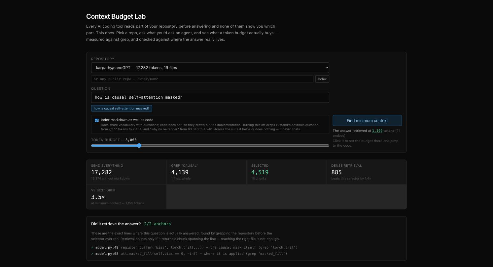

# Context Budget Lab

Every AI coding tool reads part of your repository before answering, and none of
them show you which part. You pay for that context, you can't see it, and when
the answer is wrong you can't tell whether retrieval missed something or the
model did.

This makes it visible and measurable. Point it at a repository, ask what you'd
ask a coding agent, and see what a token budget actually buys — measured against
grep and against dense retrieval, and checked against where the answer really
lives.

**Live:** https://context-budget-lab.vercel.app



*nanoGPT, at the minimum budget that still answers: 3.5x less context than best-case grep, both ground-truth anchors retrieved — and the dense baseline beating this selector by 1.4x, reported rather than hidden.*

## What it measures

**Minimum viable context** — the smallest budget at which retrieval returns the
code that answers the question. Binary search over the budget, which is only
sound because retrieval is monotone in budget (see `scripts/check-monotone.ts`).

**Recall against ground truth** — for each benchmark question, the exact line
where the mechanism lives, located by grepping the repository *before* the
selector ever ran. Returning the right file is not enough; a chunk must span the
line.

**Three strategies on the same footing** — BM25 + import-graph expansion (what
ships), a best-case grep, and a local dense baseline (all-MiniLM-L6-v2).

## How selection works

Indexing runs once per repository with no model involved: files are split at
declaration boundaries into chunks, each is token-counted, defined symbols are
recorded, and imports are parsed into a dependency graph.

Per query, still no model:

1. **Score** every chunk with BM25 — rare terms carry weight, common ones don't.
2. **Expand** along the import graph from the best matches at a decayed score.
   This is the step a text search structurally cannot perform.
3. **Pack** by score-per-token as a single prefix of one fixed priority order.

Deterministic, single-digit milliseconds, no API key anywhere. That is what makes
a live budget slider and a keyless public demo possible at all.

## The corpus

| Repo | Tokens | Markdown | Language | Why |
|---|---:|---:|---|---|
| karpathy/micrograd | 2,089 | 39% | Python | Too small for selection to earn its place |
| karpathy/nanoGPT | 17,282 | 23% | Python | The working zone |
| pallets/flask | 78,382 | 1% | Python | Code-heavy counter-case |
| pmndrs/zustand | 108,567 | 89% | TS | Doc-heavy — makes the markdown effect visible |
| karpathy/llm.c | 316,057 | 4% | C / CUDA | Scale, and a language family outside the chunker's origins |

Chosen by measurement (`scripts/pick-corpus.ts`), not by taste. Any other public
repository can be indexed live, capped at 2.5MB of source — over that the app
refuses with the real size rather than truncating.

## Results

The smallest context at which each strategy retrieves the ground-truth lines,
searched up to the repository's own size — no arbitrary ceiling, because you
cannot send more than everything. Grep is best-case: the single most selective
non-stopword term, with matching files included whole.

| Question | Repo | This selector | Best grep | Ratio |
|---|---:|---:|---:|---:|
| micrograd: how backward propagates | 2,089 | 1,475 | 806 | 0.5x |
| nanoGPT: how causal attention is masked | 17,282 | 1,199 | 4,139 | 3.5x |
| llm.c: the CPU reference attention pass | 316,057 | 65,521 | 160,776 | 2.5x |
| flask: URL to view function | 78,382 | 21,989 | 52,344 | 2.4x |
| zustand: shallow compares Maps and Sets | 108,567 | 1,257 | 7,638 | 6.1x |
| zustand: what devtools connects to | 108,567 | 7,277 | 33,997 | 4.7x |
| zustand: how persist knows it hydrated | 108,567 | 13,890 | 15,959 | 1.1x |
| zustand: when subscribeWithSelector fires | 108,567 | 2,253 | 1,811 | 0.8x |
| zustand: why a component does not re-render | 108,567 | 63,043 | 35,979 | 0.6x |

Six of nine beat grep. Three lose, and the losses are kept. llm.c holding 2.5x
matters most — that is 316k tokens of C and CUDA, a language family the chunker
was not written for.

The wins share one property: a rare identifier in the question, like
`subscribeWithSelector` or `devtools` or `masked`. The losses are questions
phrased in the domain's own vocabulary, where nothing is selective and every
method degrades together.

## Findings

**The index matters more than the algorithm.** Excluding markdown moves zustand's
questions by 57–93% and micrograd's by 55%, and moves the code-heavy repos by
0–6%. The effect tracks how doc-heavy the repository is. Documentation is
written in the vocabulary people ask questions in and the implementing code is
not, so every retriever ranks prose above mechanism — but only where there is
enough prose to matter.

| Question | With markdown | Code only | Change |
|---|---:|---:|---|
| zustand: why no re-render | 63,043 | 4,246 | 93% less |
| zustand: persist | 13,890 | 2,452 | 82% less |
| zustand: devtools | 7,277 | 2,454 | 66% less |
| micrograd: backward | 1,475 | 669 | 55% less |
| llm.c: CPU attention | 65,521 | 61,469 | 6% less |
| flask, nanoGPT | flat | flat | 0% |

**Chunk quality does not predict retrieval quality.** Making class methods into
chunk boundaries cut flask's blind force-splits from 33% to 2% and raised symbol
coverage across the corpus. Retrieval went four better, four worse, one flat.

**Nine questions cannot rank two retrieval methods.** BM25 versus dense read 8–1
for dense on one chunking and 5–4 on another. Both runs were internally fair; the
only thing that changed touched neither retriever. What survives both is that the
two fail on *different* questions — an argument for hybrid retrieval, not for
either one.

## What measurement reversed

Every one of these made the result look better than it was, and every one was
caught by running something rather than reasoning about it.

1. **Expansion outranked direct matches.** Chunks in a seed file inherited the
   repo's top score undecayed, so 27-token fragments of a types file won the
   density sort and the selector missed the answer.
2. **Recall was measured per file**, so a 22-token fragment of a file's first
   three lines counted as finding the answer. Line anchors dropped measured
   recall at 3.2k from 86% to 57%.
3. **Retrieval was non-monotone in budget.** Best-fit packing let a larger budget
   displace chunks a smaller one had found, so binary search over it was noise.
   Selection is now one prefix of one fixed order, with a check across every case.
4. **The grep baseline was a strawman.** It unioned every query term, so a common
   word pulled in 98% of zustand. Using the most selective term cut the claimed
   advantage from ~13x to ~3x. The smaller number is the real one.
5. **Embeddings were asserted as the fix** for the failing question, in the app,
   before being tested. They are not: the ten nearest neighbours are all markdown
   and the answer sites rank 134th and 170th.
6. **Two questions were reported unretrievable at any budget.** They were not —
   that was an arbitrary 64,000-token search ceiling while embeddings ranked the
   whole repo. Both resolve, and both are then beaten by grep.
7. **The indexer silently read 17% of llm.c.** The source filter had no `.c`,
   `.h` or `.cu`, so it indexed 157KB of Python and markdown, ignored 950KB of C
   and CUDA, and reported a confident reduction over the sliver it saw. Nothing
   raised. Every repo reports its coverage now.
8. **The tokenizer refused the corpus the tool is for.** js-tiktoken throws on
   special tokens and `<|endoftext|>` is ordinary source text in ML code, so
   seven of ten candidate AI repos failed to ingest.

## Method notes

Ground truth is fixed before the selector runs, every case declares its
expectation in advance, and questions expected to fail are kept — a suite that
scores 100% is a suite whose questions were chosen to score 100%.

Repositories report what share of their source was indexed — a check that exists
because its absence hid item 7 above for as long as nothing was measuring it.

## Running it

```bash
npm install
npm run dev
```

No API key is required for indexing, scoring, selection, or any reported number.

| Script | What it produces |
|---|---|
| `scripts/minimum.ts` | Minimum context per question vs grep |
| `scripts/bench.ts` | Recall across a budget sweep |
| `scripts/markdown-effect.ts` | Index-with-docs vs code-only |
| `scripts/build-embeddings.ts` | Dense baseline, run locally |
| `scripts/check-monotone.ts` | Verifies retrieval is monotone in budget |
| `scripts/chunk-quality.ts` | Force-split and symbol coverage by language |
| `scripts/selectivity.ts` | Whether advantage tracks query vocabulary or repo size |
| `scripts/grep-repo.ts` | The best-case grep baseline each result is scored against |
| `scripts/build-fixtures.ts` | Rebuilds the shipped corpus fixtures |
| `scripts/pick-corpus.ts` | How the corpus was chosen |
| `scripts/verify-ui.ts` | Headless smoke test of the deployed app |

## Licence and attribution

This project is MIT (see `LICENSE`). The fixtures redistribute source from
micrograd, nanoGPT, llm.c, flask and zustand under their own licences — see
`NOTICE` for the required copyright attributions. Live-fetched repositories are
never redistributed; they are downloaded on request and held in memory only.

## Known limits

- Nine questions is a small suite. Enough to show shape and to surface the eight
  errors listed above; not enough to claim a general result.
- Ground truth is one person's reading, though every anchor records the grep that
  found it.
- The dense baseline is one small general-purpose model; a code-trained embedding
  model would likely behave differently.
- Token counts come from cl100k, not Claude's tokenizer — exact counting is an
  authenticated API call and this must work for a visitor with no key. Ratios are
  unaffected since both sides drift together.
- Import resolution covers relative paths, the `@/` alias, and Python dotted
  modules. Custom bundler aliases are not resolved.
